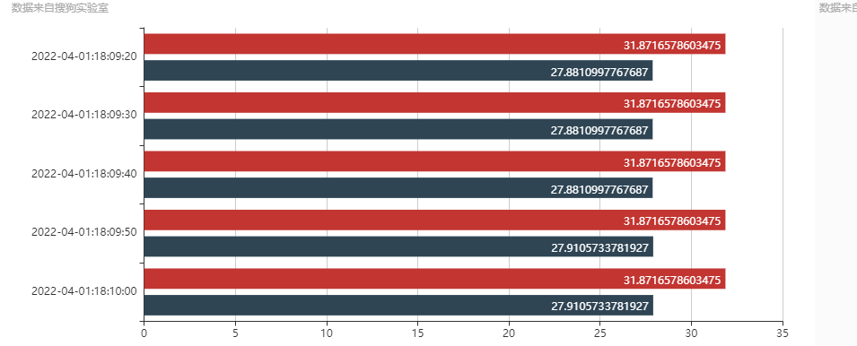
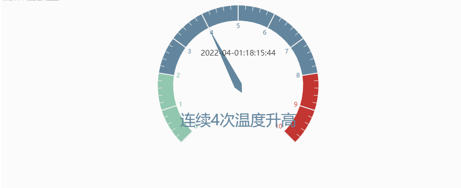
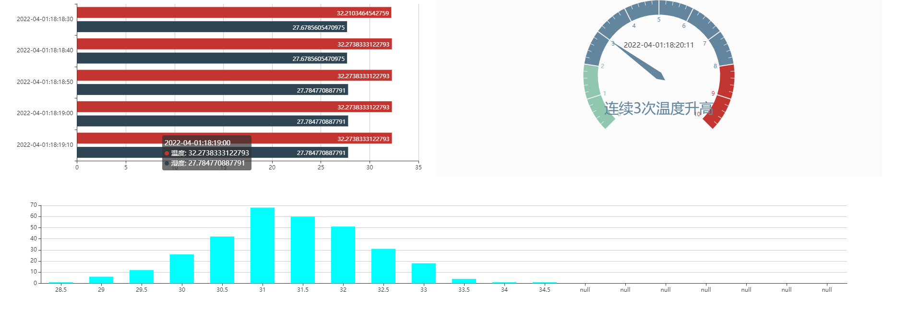

## 大数据分析NB采集的温湿度

### Flume数据采集

#### Flume尝试从天翼平台读取数据

1. 自定义CTwingSource类，继承AbstractSource类并实现Configurable和PollableSource接口

2. 重写configure函数，读取后续flume配置文件指定的天翼平台的产品ID，设备ID等

3. 在configure函数建立与天翼平台的连接并创建相应的请求

   ```java
   public void configure(Context context) {
       //通过flume配置文件获取产品Id，设备ID以及其他信息
       DeviceConfig.productID = context.getString("productID");
       DeviceConfig.deviceID = context.getString("deviceID");
       DeviceConfig.appKey = context.getString("appKey");
       DeviceConfig.appSecret = context.getString("appSecret");
       //创建连接和请求
       client = AepDeviceStatusClient.newClient().appKey(DeviceConfig.appKey).appSecret(DeviceConfig.appSecret).build();
       String request_str = "{\"productId\":\""+DeviceConfig.productID+"\",\"deviceId\":\"" + DeviceConfig.deviceID + "\"}";
       byte[] request_bytes = request_str.getBytes(StandardCharsets.UTF_8);
       request.setBody(request_bytes);
   }
   ```

4. 重写process函数,在process函数里解析请求并封装成对应的java对象

   ```java
   //将响应对象转化为字符串，然后用Json转化为Java对象
   String respond_str = response.toString();
   ParsedRespond parsed_respond = RespondParser.parse(respond_str);
   List<ContentInfo> statusList = parsed_respond.getDeviceStatusList();
   
   public static ParsedRespond parse(String respond) {
       String respond_body = StringUtils.substringAfter(respond, "body=");  // 提取响应报文体
       return (JSON.parseObject(respond_body, ParsedRespond.class));  // 将JSON解析成Java对象
   }
   ```

5. 将解析的java对象通过Flume时间写入channel

   ```java
   //将每个ContentInfo通过flume采集出去
   for(ContentInfo e : statusList){
       //设置头信息
       header.put("datasetId", e.getDatasetId());
       event.setHeaders(header);
       event.setBody(e.toString().getBytes(StandardCharsets.UTF_8));
       getChannelProcessor().processEvent(event);
       //清空头信息
       header.clear();
       Thread.sleep(1000);
   }
   
   ```

#### 编写Flume的配置文件

1. 一个Source、两个file Channel、一个hdfs sink，一个kafka sink

2. flume的source的选择器为replicating

   ```xml
   a1.sources = s1
   a1.channels = c1 c2
   a1.sinks = k1 k2
   
   #sources
   a1.sources.s1.type = TAILDIR
   a1.sources.s1.positionFile = /home/hadoop/data/Ctwing/taildir_position.json
   a1.sources.s1.filegroups = f1
   a1.sources.s1.filegroups.f1 = /home/hadoop/data/Ctwing/ctwingdata.txt
   a1.sources.s1.channels = c1 c2
   
   a1.sources.s1.selector.type = replicating
   
   #channels
   a1.channels.c1.type = file
   a1.channels.c1.checkpointDir = /home/hadoop/data/Ctwing/checkpointDir
   a1.channels.c1.dataDirs = /home/hadoop/data/Ctwing/dataDirs
   
   #channels
   a1.channels.c2.type = file
   a1.channels.c2.checkpointDir = /home/hadoop/data/Ctwing/checkpointDir2
   a1.channels.c2.dataDirs = /home/hadoop/data/Ctwing/dataDirs2
   
   
   #sinks
   a1.sinks.k1.type = org.apache.flume.sink.kafka.KafkaSink
   a1.sinks.k1.channel = c1
   a1.sinks.k1.topic = tmpctwing
   a1.sinks.k1.brokerList = s0:9092,s1:9092,s2:9092
   #1代表仅收到leader的请求
   a1.sinks.k1.producer.acks = 1
   
   # Describe the sink
   a1.sinks.k2.type = hdfs
   a1.sinks.k2.hdfs.path = hdfs://mycluster/ctwing/%Y%m%d/%H
   #上传文件的前缀
   a1.sinks.k2.hdfs.filePrefix = ctwing-
   #是否使用本地时间戳
   a1.sinks.k2.hdfs.useLocalTimeStamp = true
   #积攒多少个Event才flush到HDFS一次
   a1.sinks.k2.hdfs.batchSize = 100
   #设置文件类型，可支持压缩
   a1.sinks.k2.hdfs.fileType = DataStream
   #多久生成一个新的文件
   a1.sinks.k2.hdfs.rollInterval = 0
   #设置每个文件的滚动大小
   a1.sinks.k2.hdfs.rollSize = 0
   a1.sinks.k2.hdfs.rollCount = 0
   
   
   a1.sinks.k1.channel = c1
   a1.sinks.k2.channel = c2
   ```

   

#### 特色

1. 一个FLume agent采集一个设备的数据，实现了数据的分布式采集
2. 采集的数据通过replicat的方式分布采集到HDFS进行离线数据分析，采集到Kafka进行实时分析
3. 定义拦截器只采集数据类型为temp的humidity的

实现Interceptor接口并实现intercept方法

```java
public Event intercept(Event event) {
    // 区分日志类型：   body  header
    // 1 获取body数据
    String log = new String(event.getBody());
    // 2 获取header
    Map<String, String> headers = event.getHeaders();

    if(log.contains("start")){
        headers.put("topic", "topic_start");
    }
    else{
        headers.put("topic", "topic_event");
    }

    return event;
}
```


Flume采集出现的问题

1. 自定义的Flink Source无法建立与天翼平台的客户端连接，无法知道哪里出错了
2. 为了保证数据不丢失，产生了很多的重复数据，无法控制
3. 发现平台的数据和统计的计算不一致，数据重复，通过状态编程存储上一个数据的时间戳，在当前数据判断前一个时间戳和当前时间戳是否相等[在Flink端通过状态编程解决]，在Flume端通过选择器进行去重

## Flink数据分析

### 统计温度区间是的高斯分布

1. 从Kafka读取数据

2. 数据过滤并封装成POJO

3. 因为温度值都是同一个，对温度数据进行高斯分布处理

   ```java
   public TempAndHumiFlatMap() {
               //初始化温度区间
               for(int i = 0;i < 20; ++i){
                   arr[i] = 25.5 + i * 0.5;
               }
   }
   ```

   

4. 将温度映射到固定的区间，并统计每个区间的count值，自定义MySQL SInk将数据存入MySQL数据库

   ```java
   private double calculateInterval(double value){
       for(int i = 0; i < arr.length; i++){
           if(arr[i] >= value){
               return arr[i];
           }
       }
       //前面没有返回说明温度值大于最大值，那么返回最大值的区间
       return arr[arr.length - 1];
   }
   
   private static class MysqlSink extends RichSinkFunction<Tuple3<String,Double,Long>> {
           private Connection conn = null;
           private PreparedStatement preparedStatement;
           @Override
           public void open(Configuration parameters) throws Exception {
               super.open(parameters);
               Class.forName(GlobalConfig.DRIVER_CLASS);
               conn = DriverManager.getConnection(GlobalConfig.DB_URL, GlobalConfig.USER_NAME, GlobalConfig.PASSWORD);
           }
   
           @Override
           public void close() throws Exception {
               super.close();
               if(preparedStatement != null){
                   preparedStatement.close();
               }
               if(conn != null){
                   conn.close();
               }
               super.close();
           }
   
           @Override
           public void invoke(Tuple3<String, Double,Long> value, Context context) throws Exception {
               try {
                   double interval = value.f1;
                   long count = value.f2;
                   String querySQL = "SELECT intervalcount FROM tempintervalcount where tempinterval = " + interval;
                   System.out.println(querySQL);
                   String updateSQL = "update tempintervalcount set intervalcount = " + count + " where tempinterval = " + interval;
                   System.out.println(updateSQL);
                   String insertSQL = "insert into tempintervalcount(tempinterval,intervalcount) values(" + interval +"," + count +")";
                   System.out.println(insertSQL);
                   preparedStatement = conn.prepareStatement(querySQL);
                   ResultSet resultSet = preparedStatement.executeQuery();
                   if(resultSet.next()){
                       preparedStatement.executeUpdate(updateSQL);
                   }
                   else{
                       preparedStatement.execute(insertSQL);
                   }
               } catch (Exception e) {
                   e.printStackTrace();
               }
           }
       }
   ```

   

5. Servlet读取数据库数据，使用Echart可视化，观察柱状图程高斯分布

   

### 统计每个设备在每个时段温度的最大值最小值(增量聚合)

1.  从Kfaka读取数据，数据过滤

2. 按照datasetId分组，只有两组数据，为了提高并行度，先按照随机数和datasetId分组

3. 开窗统计，然后按照时间和datasetId分组，在下流进行下一步的聚合

   ```java
   DataStream<TempAndHumiMaxBean> resultStream = pojoStream.keyBy(TempAndHumiBean::getDatasetId)
   .timeWindow(Time.minutes(1),Time.seconds(10))
   .aggregate(new TempAndHumiMaxAgg(),new TempAndHumiMaxWindow());//采用增量聚合的方式
   resultStream.addSink(new TempAndHumiMaxMysqlSink());
   resultStream.print();
   env.execute();
   
   public static class TempAndHumiMaxAgg implements AggregateFunction<TempAndHumiBean,Double, Tuple2<String,Double>> {
           private String dataSetId = "unknown";
           @Override
           public Double createAccumulator() {
               return Double.MIN_VALUE;
           }
   
           @Override
           public Double add(TempAndHumiBean tempAndHumiBean, Double aDouble) {
               dataSetId = tempAndHumiBean.getDatasetId();
               return Math.max(aDouble, tempAndHumiBean.getValue());
           }
   
           @Override
           public Tuple2<String, Double> getResult(Double aDouble) {
               return new Tuple2<>(dataSetId,aDouble);
           }
   
           @Override
           public Double merge(Double aDouble, Double acc1) {
               return Math.max(aDouble, acc1);
           }
       }
   
       public static class TempAndHumiMaxWindow implements WindowFunction<Tuple2<String,Double>, TempAndHumiMaxBean, String, TimeWindow> {
           @Override
           public void apply(String s, TimeWindow timeWindow, Iterable<Tuple2<String,Double>> iterable, Collector<TempAndHumiMaxBean> collector) throws Exception {
               Tuple2<String,Double> value = iterable.iterator().next();
               collector.collect(new TempAndHumiMaxBean(timeWindow.getStart(), timeWindow.getEnd(), value.f0, value.f1));
           }
       }
   ```

4. Servlet读取数据库数据，使用Echart可视化，观察每个时间段温度和湿度的最大值

   

### 统计连续上升的温度次数大于阈值的次数

1. 从Kfaka读取数据，数据过滤

2. 按照设备ID分组，调用底层API proces函数统计一段时间内温度持续上升的次数

3. 需要使用状态编程记录前一个温度和温度开始上升的时间还有上升的次数

   ```java
   public static class TempIncreaseCount extends KeyedProcessFunction<Tuple,TempAndHumiBean, Tuple3<String,Long,Long>> {
   
           private ValueState<Long> startTsState;
           private ValueState<Double> prevalueState;
           private ValueState<Long> countState;
           private Long limit;
   
           public TempIncreaseCount(Long limit) {
               this.limit = limit;
           }
   
           @Override
           public void open(Configuration parameters) throws Exception {
               startTsState = getRuntimeContext().getState(new ValueStateDescriptor<Long>("startTs", Long.class));
               prevalueState = getRuntimeContext().getState(new ValueStateDescriptor<Double>("prevalue", Double.class));
               countState = getRuntimeContext().getState(new ValueStateDescriptor<Long>("count", Long.class));
           }
   
           @Override
           public void processElement(TempAndHumiBean value, Context ctx, Collector<Tuple3<String,Long,Long>> out) throws Exception {
               Double prevalue = prevalueState.value();
               Long count = countState.value();
               if (prevalue == null || prevalue >= value.getValue()){
                   startTsState.update(value.getTimestamp());
                   prevalueState.update(value.getValue());
                   countState.update(1L);
               }
               else{
                   prevalueState.update(value.getValue());
                   countState.update(count + 1);
               }
               if(countState.value() >= limit){
                   out.collect(new Tuple3<>(value.getDeviceId(),startTsState.value(),countState.value()));
               }
           }
       }
   ```

   

4. 将数据存入数据数据库，servelt读取数据并显示前端



### 总体图



## 

## 项目大体情况(自己做的练习项目)

1. 使用中国电信的NB传感器采集温湿度数据并通过Flume从天翼平台采集数据，
2. 自定义Flume Source和拦截器并编写配置文件，将数据通过Flume分别采集到Kafka和HDFS，以便用于离线批处理和实时处理，可以实现一个Flume agent采集一个设备的数据，实现分布式数据采集
3. Flink分析了温度区间分布，温湿度数据在一点时间内的最大值，温度连续上升的次数
4. 在统计温度区间分布时进行特殊处理，因为短时间内传感器采集的温度都是一样的，没什么变化，所以我在分析时按照高斯分布给数据加上一个随机数，均值就是采集到的真实数据，方差是0，然后将处理后的数据映射到一个固定的温度区间，将处理的数据存入MySQL，最后用servlet和echart做了一个可视化web界面，可以在web慢慢看到一个呈高斯分布的柱状图
5. 第二个需求通过flink开窗，然后利用增量聚合函数统计一段时间内的温度和湿度的最大值，最后也是将数据存储mysql并在web页面展示动态效果
6. 第三个需求是通过状态编程来实现，当温度连续上升的次数到达阈值时，发出报警信息，状态保存的是前一个数据的温度，当前已经连续上升的次数和温度开始上升的时间

#### 项目特色：

1. 一个flume agent采集一个设备的数据，实现了分布式数据采集
2. 制作了web可视化，能够通过实时变化的柱状图查看数据情况

#### 问题：

1. 数据重复，Flume采集数据自定义Source也是通过电s信提供的SDK读取平台读取数据，但是读取的是最新的一条数据，当传感器传输数据较慢时，或者传感器断电时，Flume将会采集到重复数据，即最新一条数据。解决办法：开发Flume拦截器，判断当前数据的时间戳是否和前面记录的时间相同
2. 统计温度和湿度在一段时间内的最大值时，按照数据类型keyby只会分成两组，因为两种数据类型，此时并行度不高。解决办法，加入一个随机数字段，按照随机数和datasetid分组，先统计部分，然后在按照dataseid分组进行聚合，有点像归并的感觉。
